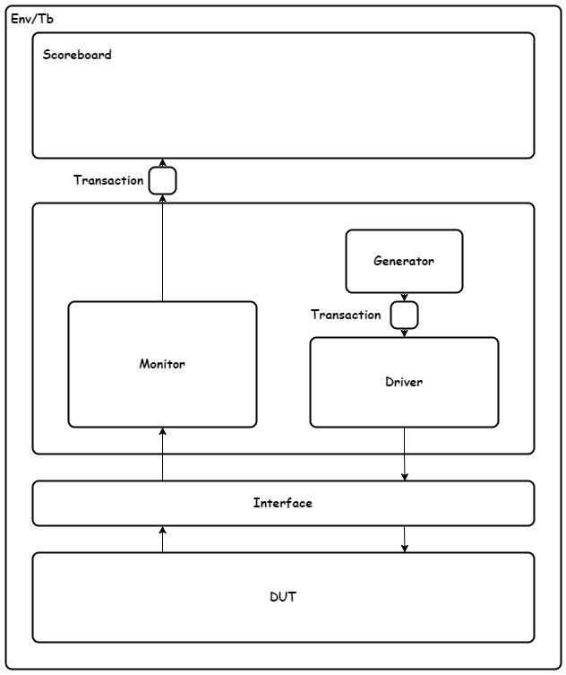

# Verification Plan

Before AHB verification was performed, a plan (see table below) was formulated testing key points within each digital block according to the specification provided by ARM. This includes unit level and formal tests in both the GPIO and VGA. After Parity and Dual-Lock-Step were added to each respectively - a top level integration test was performed to ensure continued compatability with all circuit blocks.

## Unit-Level Testbench Structure

Each unit level testbench was based on the structure below allowing for easy transfer of code between GPIO and VGA.

## Overall Plan
|     AHB_Peripheral    |     Name                       |     Description                                                                                                                                |     Verification Type    |     Formal Check Name      |
|-----------------------|--------------------------------|------------------------------------------------------------------------------------------------------------------------------------------------|--------------------------|----------------------------|
|     GPIO              |     Reset                      |     Ensure all GPIO outputs   are held at 0 on the negative edge of reset                                                                      |     Unit-Level           |                            |
|                       |     Direction                  |     If valid write and   direction address set, expect direction register to equal HWDATA                                                      |     Unit-Level/Formal    |     Check_dir              |
|                       |     GPIOOUT Write              |     If valid write and   direction set to output, expect GPIOOUT to equal HWDATA from the previous   cycle                                     |     Unit-Level/Formal    |     Check_write            |
|                       |     GPIOOUT Read               |     Every clock cycle, if direction   set to output, expect HRDATA to equal GPIOOUT from the previous cycle                                    |     Unit-Level/Formal    |     Check_read_out         |
|                       |     GPIOIN Read                |     Every clock cycle, if direction   set to input, expect HRDATA to equal GPIOIN from the previous cycle                                      |     Unit-Level/Formal    |     Check_read_in          |
|                       |     PARITYERR GPIOIN           |     If reading from GPIOIN expect   output PARITYERR to be high if Parity bit (GPIOIN[16]) is wrong dependant on   PARITYSEL                   |     Unit-Level/Formal    |     Check_parityerr_in     |
|                       |     PARITYERR GPIOOUT          |     If reading from GPIOOUT expect   output PARITYERR to be high if Parity bit (GPIOOUT[16]) is wrong dependant on   PARITYSEL                 |     Unit-Level/Formal    |     Check_parityerr_out    |
|                       |     PARITY BIT GPIOOUT         |     If writing to GPIOOUT, expect   GPIOOUT[16] to be asserted dependant on PARITYSEL and number of bits in GPIOOUT[15:0]                      |     Unit-Level/Formal    |     Check_parity_out       |
|     VGA               |     Character Print            |     If writing a character   into VGA, expect that character on the display in the order of input. (Test   automatically with a checker)       |     Unit-Level           |                            |
|                       |     Front Porch/ Back Porch    |     Visually check length of   Front Porch and Back Porch for both vertical and horizontal axis. Expect to   be equal to values in VGA_SYNC    |     Unit-Level           |                            |
|                       |     DLS Error                  |     If Primary and Secondary   VGA instances output different signals expect DLS_ERROR to be asserted on the   next clock cycle                |     Unit-Level/Formal    |     Check_dls              |
|                       |     Frame Width                |     Number of clocks between   negative edges should stay the same at 801 (1602 due to halved clock in VGA)   if control signals asserted      |     Formal               |     Check_hsync            |
|                       |     HSYNC pulse width          |     Expect the pulse width of   HSYNC to be low for 96 cycles (192)                                                                            |     Formal               |     Check_hsync_pulse      |
|     AHBLITE_SYS       |     GPIO Test                  |     Be able to Read from   GPIOIN, and then Write to GPIOOUT                                                                                   |     Top-Level            |                            |
|                       |     VGA Test                   |     Be able to write “Hello”   onto VGA                                                                                                        |     Top-Level            |                            |
