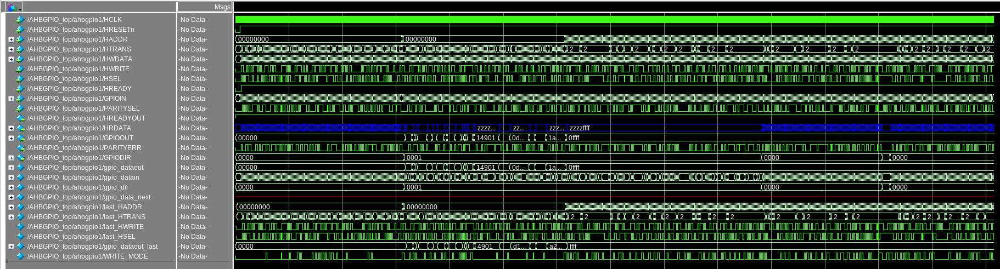
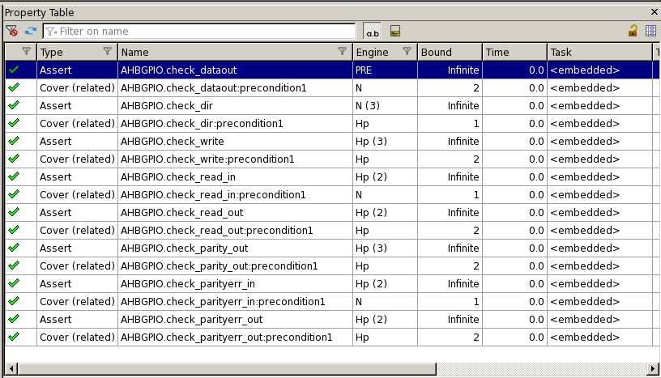
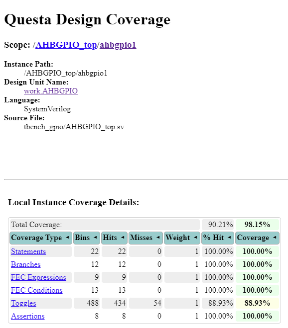
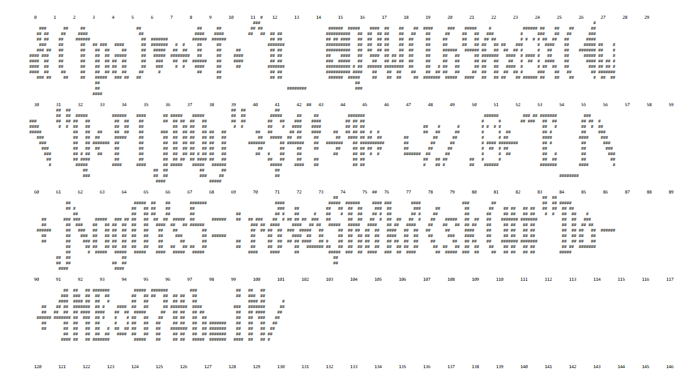
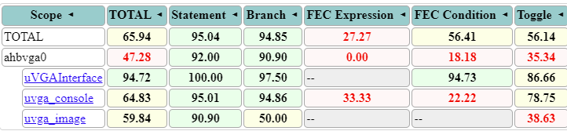
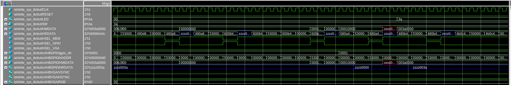
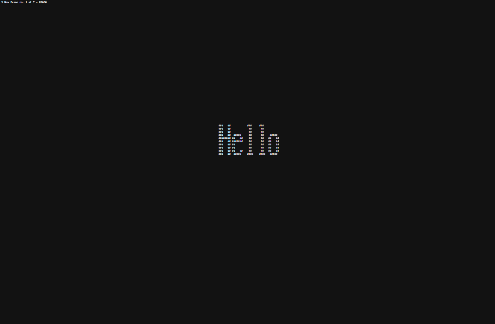
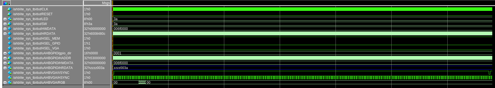
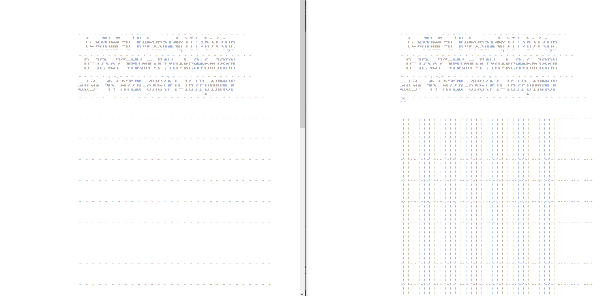

# Verification Report 

## Unit-Level Tests

### GPIO

To start, GPIO was editted to include Parity bits at the output of GPIOOUT and GPIOIN was increased by 1 in length to house a parity bit. (This acts in the same way as a bug injection during testing)

GPIO was tested using 3 seperate tests:
1. Direction was set to 0 and most signals randomly generated to test all possible cases of read from GPIOIN
2. Direction was set to 1 and most signals randomly generated to test all possible cases of read and write at GPIOOUT
3. Completely random testing with all inputs randomized and the direction changing every 10 packets

This allowed for 98% code coverage overall and resulted in a very robust checker housed in the scoreboard. For further completeness, formal verification was used to test the GPIO specification with all assertions passing as shown below. (These can be found in the RTL of the GPIO)

#### Random Constrained Wave Output

#### Formal Verification

#### Coverage Report for RTL GPIO_Parity.sv

### VGA DLS

Again, the first thing required to be completed was the Dual-Lock-Step for VGA with an extra input to inject errors. 

The VGA was tested by getting making an automated character checker in the Scorboard of the testbench. This was done in real time by keeping valid input characters in a buffer and then checking that each of these characters was placed correctly by the VGA in the proper index. (Note the numbering in my output print of VGA). The checker works out where it is in the display region using hsync and vsync and then subsequenctly goes line by line and checks each indivdual pixel with that found in a font library adapted from the font ROM

Overall, this meant the input to VGA could be completly randomized with a specific constraint on special characters such as new line and backspace. Note the display region is shifted to the right meaning that the last character is cut off (Fixed by increasing display region size in later interations)

#### VGA Print Frame with Indexing.sv

#### Coverage Report for RTL AHBVGADLS.sv

## Top-Level Tests

### GPIO

A simple top level test was formulated for the GPIO the source code of which can be found in *./Hardware/AHB_peripherals/src*. All functionality of GPIO is tested by reading a value from GPIOIN and then printing this to GPIOOUT. GPIOUT is then read from succesfully.

#### Wave Output

### VGA

Another simple integration test was performed with VGA with "Hello" being printed in the first portion of the display region. 

#### TOP VGA Print

#### Wave Output

## Bugs
I found some evident bugs in VGA with some examples shown below.
1. The Display region was clipped at the end
2. The letters were duplicated at the front of every line - fixed by editting new line logic
3. The letters were 'fatter' at the front of each line 
4. There was no 'default' case in the FONT_ROM which led to undefined behaviour as seen in the picture to the below right.

